# Claude Code × GitHub でWebサイトを作る方法

**初心者向けステップバイステップガイド**

---

## はじめに

このガイドでは、**Claude Code**（AIアシスタント）と**GitHub Pages**を使って、無料でWebサイトを公開する方法を解説します。

### 必要なもの
- パソコン（Mac または Windows）
- インターネット接続
- GitHubアカウント（無料）
- Claude Code

### 所要時間
約15〜30分

---

## Step 1: GitHubにログインする

### 1-1. GitHubにアクセス

ブラウザで [https://github.com](https://github.com) を開きます。

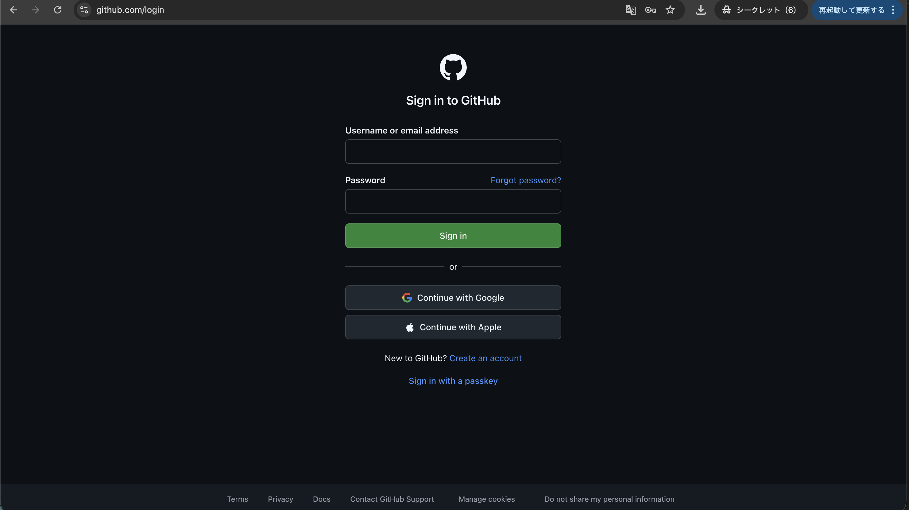

### 1-2. ログインする

- **Username or email address**: メールアドレスまたはユーザー名を入力
- **Password**: パスワードを入力
- **Sign in** ボタンをクリック

> **アカウントを持っていない場合**
> 画面下の「Create an account」をクリックして、新規登録してください。

---

## Step 2: 新しいリポジトリを作成する

### 2-1. ダッシュボードを確認

ログインすると、ダッシュボード画面が表示されます。

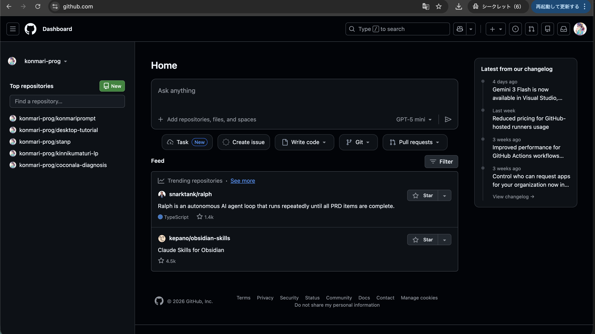

### 2-2. 「+」ボタンをクリック

画面**右上**にある「**+**」ボタンをクリックします。

ドロップダウンメニューが表示されるので、「**New repository**」をクリックします。

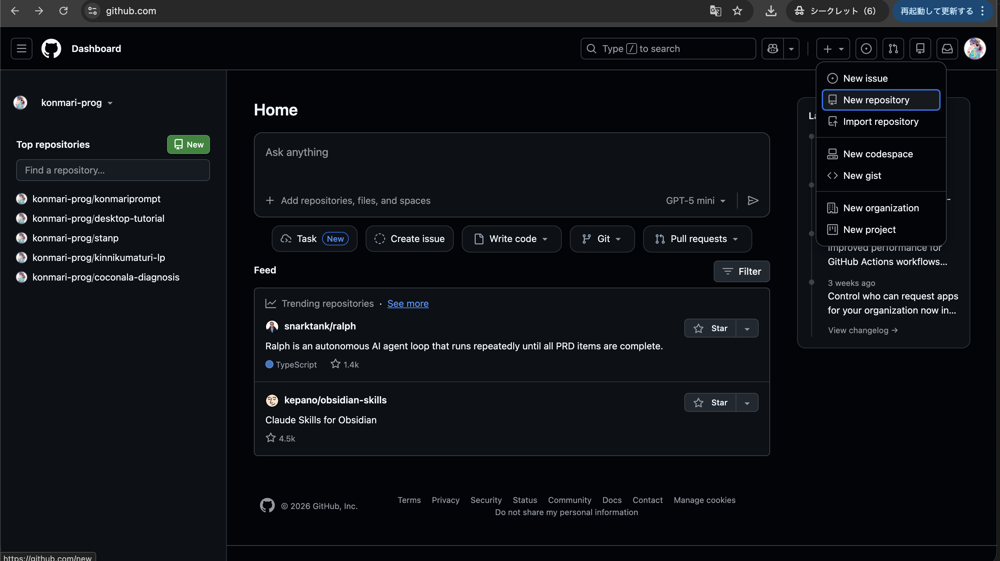

### 2-3. リポジトリ情報を入力

リポジトリ作成画面が表示されます。

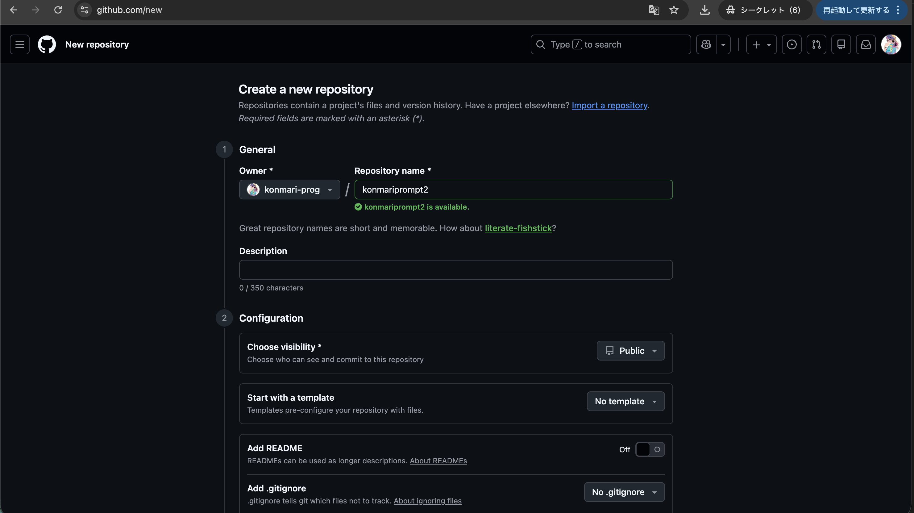

入力する項目：

| 項目 | 入力内容 |
|------|----------|
| **Repository name** | サイトの名前（英数字）例：`mywebsite` |
| **Description** | 説明（省略可） |
| **Public / Private** | **Public** を選択（無料で公開するため） |

### 2-4. 「Create repository」をクリック

画面を下にスクロールして、緑色の「**Create repository**」ボタンをクリックします。

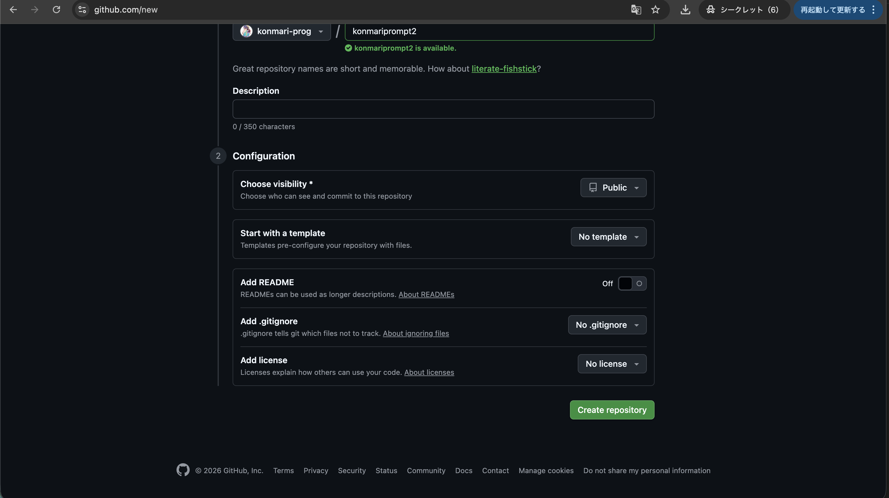

### 2-5. リポジトリ作成完了

以下の画面が表示されたら、リポジトリの作成完了です。

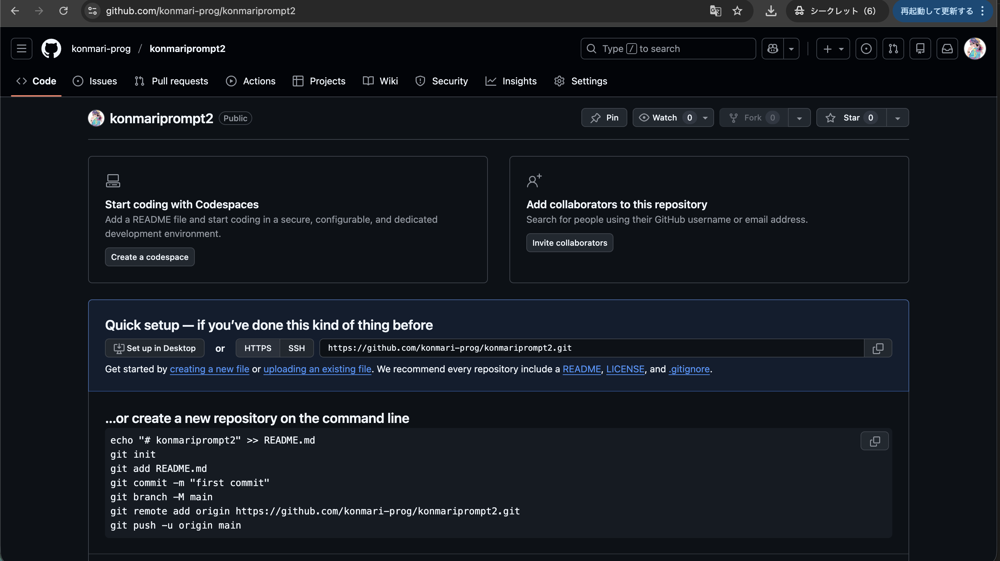

この画面に表示されている **URL**（`https://github.com/ユーザー名/リポジトリ名.git`）は後で使います。

---

## Step 3: Claude Codeでサイトを作成する

### 3-1. Claude Codeを開く

Claude Codeを起動します。

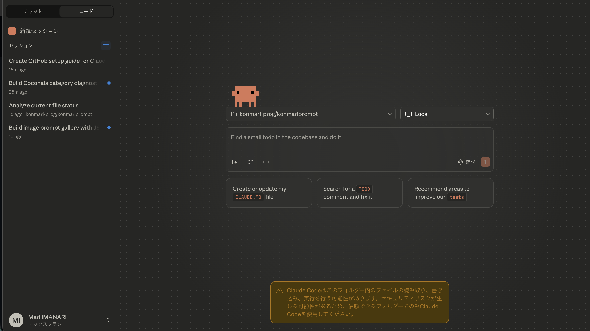

### 3-2. プロジェクトフォルダを指定

Claude Codeにプロジェクトフォルダを伝えます。

### 3-3. サイト作成を依頼する

チャット欄に、作りたいサイトの内容を入力します。

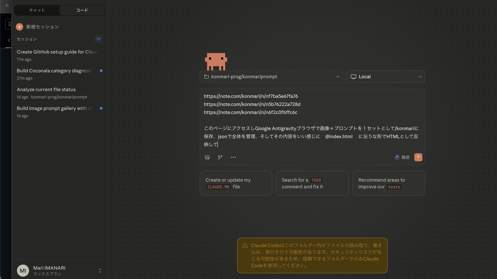

**指示の例：**

```
プロンプト集のサイトを作って。
- タイトルは「KONMARI prompt」
- 画像とプロンプトを一覧表示
- コピーボタンを付けて
```

### 3-4. サイトが作成される

Claude Codeが自動的に以下のファイルを作成します：

```
プロジェクトフォルダ/
├── index.html      ← メインのHTMLファイル
├── prompts.json    ← データファイル
└── images/         ← 画像フォルダ
```

### 3-5. GitHubにプッシュする

サイトができたら、Claude Codeに以下のように指示します：

```
GitHubにプッシュして
```

Claude Codeが自動的にGitHubにアップロードしてくれます。

---

## Step 4: GitHub Pagesを有効化する

### 4-1. リポジトリのSettingsを開く

GitHubのリポジトリページで、上部メニューの「**Settings**」をクリックします。

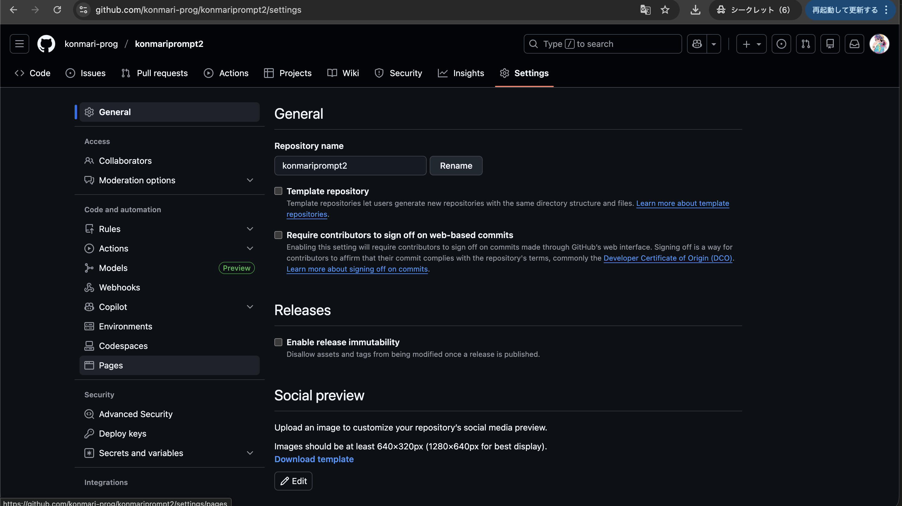

### 4-2. Pagesメニューを開く

左側のサイドバーをスクロールして、「**Pages**」をクリックします。

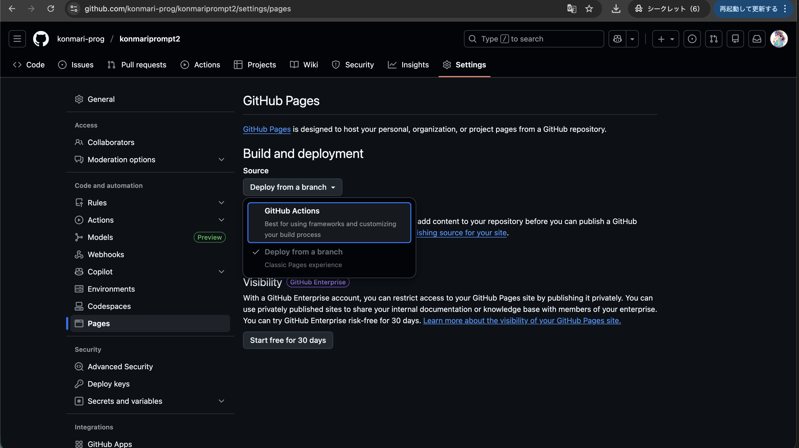

### 4-3. ソースを設定する

**Build and deployment** セクションで：

1. **Source** の下にあるドロップダウンをクリック
2. 「**Deploy from a branch**」を選択

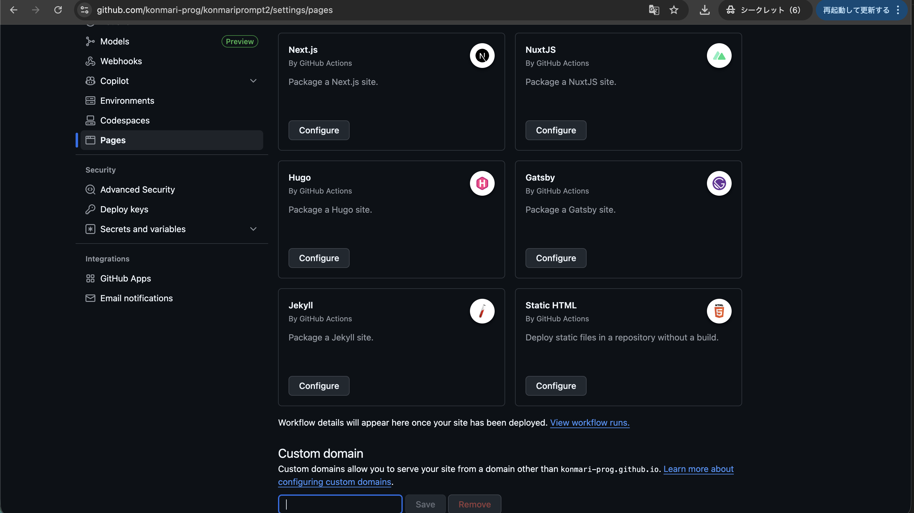

続けて：

3. **Branch** で「**main**」を選択
4. フォルダは「**/ (root)**」のまま
5. 「**Save**」ボタンをクリック

### 4-4. 公開完了！

数分待つと、サイトが公開されます。

公開URLは以下の形式です：

```
https://ユーザー名.github.io/リポジトリ名/
```


---

## Step 5: サイトを更新する

### 5-1. 変更を依頼

Claude Codeに変更したい内容を伝えます：

```
カラーテーマを青に変更して
```

```
新しいカテゴリーを追加して
```

```
デザインをもっとおしゃれにして
```

### 5-2. プッシュする

変更ができたら：

```
GitHubにプッシュして
```

### 5-3. 反映を確認

- GitHub Pagesの反映には **1〜5分** かかることがあります
- 変わらない場合は **Cmd + Shift + R**（Mac）または **Ctrl + Shift + R**（Windows）で強制リロード

---

## よくある質問

### Q: サイトが表示されない

**A:** 以下を確認してください：
1. GitHub Pagesが有効になっているか（Step 4を確認）
2. Branchが「main」になっているか
3. index.htmlファイルがあるか

### Q: 画像が表示されない

**A:** 画像のファイル名を確認してください：
- 日本語ファイル名は避ける
- スペースを使わない
- 例：`image1.png`（OK）、`画像 1.png`（NG）

### Q: 変更が反映されない

**A:** ブラウザのキャッシュをクリアしてください：
- **Mac**: Cmd + Shift + R
- **Windows**: Ctrl + Shift + R
- または、シークレットウィンドウで開く

### Q: デザインを変えたい

**A:** Claude Codeに参考サイトのURLを添えて依頼すると効果的です：

```
https://example.com このサイトのようなデザインにして
```

---

## Tips: 上手に指示を出すコツ

### 具体的に伝える

| NG | OK |
|----|-----|
| おしゃれにして | シアンとピンクのグラデーションで |
| いい感じに | 一画面に収まるレイアウトで |

### 参考サイトを添える

```
https://example.com このテイストで作って
```

### スクリーンショットを見せる

問題がある時は、画面のスクリーンショットを添付すると解決が早いです。

### 一度に一つずつ

複数の変更は分けて依頼すると、確実に反映されます。

---

## まとめ

| ステップ | やること | 所要時間 |
|---------|---------|---------|
| 1 | GitHubにログイン | 1分 |
| 2 | リポジトリを作成 | 2分 |
| 3 | Claude Codeでサイト作成 | 5〜15分 |
| 4 | GitHub Pages有効化 | 3分 |
| 5 | 必要に応じて更新 | - |

**Claude Codeへの指示 → プッシュ → 確認** のサイクルを繰り返すだけで、プロ級のサイトが作れます！

---

## 参考リンク

- [GitHub](https://github.com)
- [GitHub Pages ドキュメント](https://docs.github.com/ja/pages)
- [Claude Code](https://claude.com/claude-code)

---

*このガイドは Claude Code で作成されました*
